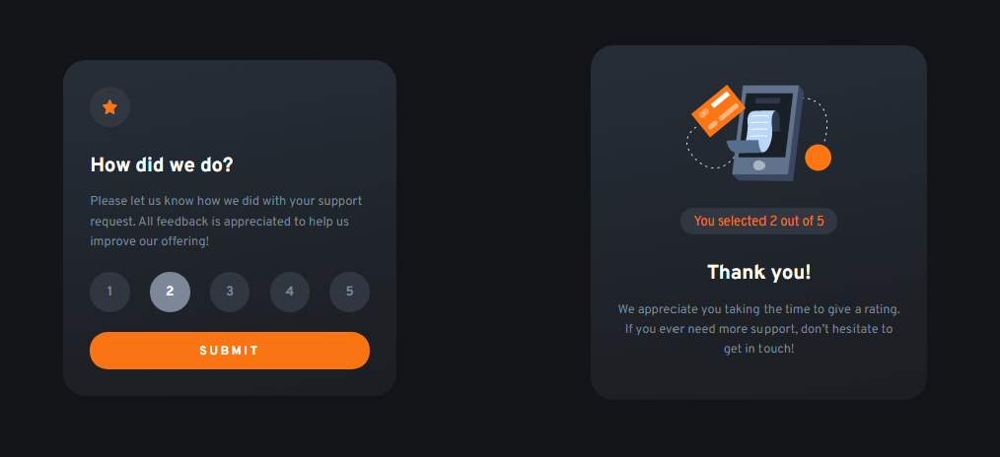

# Frontend Mentor - Interactive rating component solution

This is a solution to the [Interactive rating component challenge on Frontend Mentor](https://www.frontendmentor.io/challenges/interactive-rating-component-koxpeBUmI). Frontend Mentor challenges help you improve your coding skills by building realistic projects.

## Table of contents

- [Overview](#overview)
  - [The challenge](#the-challenge)
  - [Screenshot](#screenshot)
  - [Links](#links)
- [My process](#my-process)
  - [Built with](#built-with)
  - [What I learned](#what-i-learned)
  - [Continued development](#continued-development)
  - [Useful resources](#useful-resources)
- [Author](#author)
- [Acknowledgments](#acknowledgments)


## Overview

### The challenge

Users should be able to:

- View the optimal layout for the app depending on their device's screen size
- See hover states for all interactive elements on the page
- Select and submit a number rating
- See the "Thank you" card state after submitting a rating

### Screenshot




### Links

- Solution URL: [Add solution URL here](https://your-solution-url.com)
- Live Site URL: [Add live site URL here](https://your-live-site-url.com)

## My process

### Built with

- Semantic HTML5 markup
- CSS custom properties
- Flexbox
- CSS Grid
- Mobile-first workflow
- [React](https://reactjs.org/) - JS library
- [Next.js](https://nextjs.org/) - React framework
- [Styled Components](https://styled-components.com/) - For styles
- [Modern css reset](https://piccalil.li/blog/a-modern-css-reset/) - piccalil


### What I learned

Use this section to recap over some of your major learnings while working through this project. Writing these out and providing code samples of areas you want to highlight is a great way to reinforce your own knowledge.


```html
  <div class="rating-numbers-container">
      <div class="numbers | one" state="not-active">1</div>
      <div class="numbers | two" state="not-active">2</div>
      <div class="numbers | three" state="not-active">3</div>
      <div class="numbers | four" state="not-active">4</div>
      <div class="numbers | five" state="not-active">5</div>
  </div>
  <div class="button-container">
      <button id="button" type="button">SUBMIT</button>
  </div>
```
```css
.numbers[state="active"]{
    cursor: pointer;
    background-color: var(--neutral-300);
    color: var(--neutral-100);
}

@media (hover: hover){
    .button-container > button:hover{
        background-color: var(--neutral-100);
        cursor: pointer;
        color: var(--primary-orng);
    }
    .numbers:hover {
        cursor: pointer;
        background-color: var(--primary-orng);
        color: var(--neutral-100);
    }
}
```
```js
const submitBtn = document.getElementById("button");
const ratingValues = document.getElementsByClassName("numbers");
const currStates = toGetListState(ratingValues);

const pagesDisplay = document.getElementsByClassName('pages');
const indexChoiceDisplay = document.getElementById('displayChoice');
var indexChoice = 0;


for(let i=0 ; i < ratingValues.length ; i++){
let d = i + 1;
ratingValues[i].addEventListener('click',function (){
    if (ratingValues[i].getAttribute('state') == 'active'){
        ratingValues[i].setAttribute('state','not-active');
    } else {
        ratingValues[i].setAttribute('state','active');
        coloriseOnlyClicked(ratingValues, i);
        indexChoice = i + 1;
    }
})
}

submitBtn.addEventListener('click',function() {
    const listOfCurrentState = toGetListState(ratingValues);
    const state='active'

    if (listOfCurrentState.includes(state)){
        pagesDisplay[0].style.display = 'none';
        pagesDisplay[1].style.display = '';
        indexChoiceDisplay.innerHTML = 'You selected ' + indexChoice + ' out of 5';
    }
})


function coloriseOnlyClicked(listOfVariables, n) {
    for (let i = 0; i < listOfVariables.length ; i++){
        if (i != n){
            listOfVariables[i].setAttribute('state','not-active');
        }else{
            continue;
        }
    }
}


function toGetListState(list){
    const states = [];
    for (let i = 0 ; i < list.length ; i++){
        var curState= list[i].getAttribute('state');
        states.push(curState);
    }
    return states;
}
```


### Continued development

My first project with menu, Im so glad for finishing this work. Specialy the mobile version with the side menu on the right.


### Useful resources

- [W3schools](https://www.w3schools.com/) - This helped me for javaScript eventListener. I really liked this pattern and will use it going forward.
- [stackoverflow](https://stackoverflow.com/) - this website help me on the javascript when i get stock.
## Author

- Website - [Mohamed Sagou](https://github.com/medsagou)
- Frontend Mentor - [@medsagou](https://www.frontendmentor.io/profile/medsagou)
- Twitter - [@sagoumohamed](https://www.twitter.com/sagoumohamed)

## Acknowledgments

nothing for this project.
